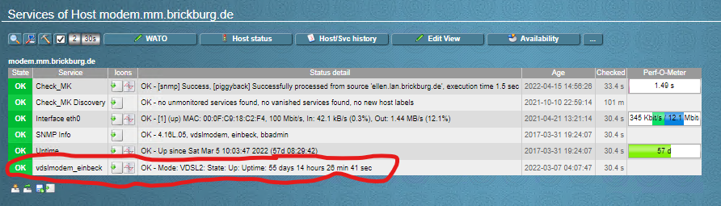
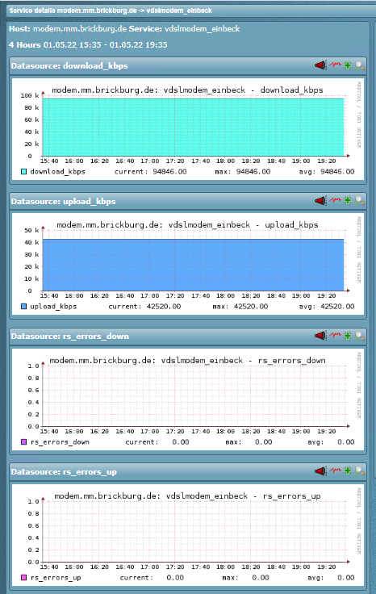

# ALLNET ALL-BM200VDSL2V VDSL Modem

| Name | Description |
|------|-------------|
| **Name** | check_allnetvdsl |
| **Type** | piggyback plugin |
| **Description** | Parses the status website of the modem and adds the current status to the SNMP monitored host |

## Installation

- SNMP Settings must be configured on the modem
- Modem must be present in Check_MK as a SNMP monitored host
- Put the check script on your piggyback host as `/usr/lib/check_mk_agent/plugins/check_allnetvdsl`
- Put the yml config on your puggyback host as `/etc/check_mk/check_allnetvdsl_config.yml`
- Modify the settings in the config file

Make sure [the piggyback mechanics are enabled](https://docs.checkmk.com/latest/en/piggyback.html) in your setup.

## Demo

