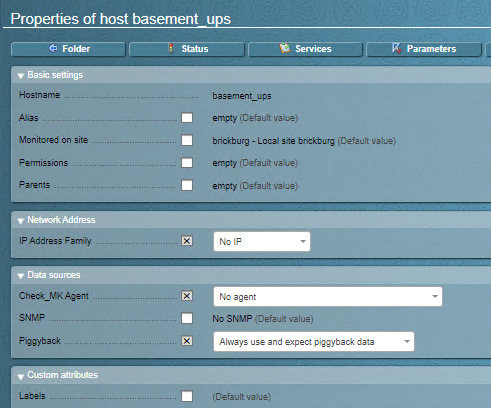
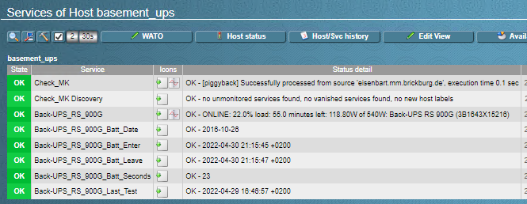
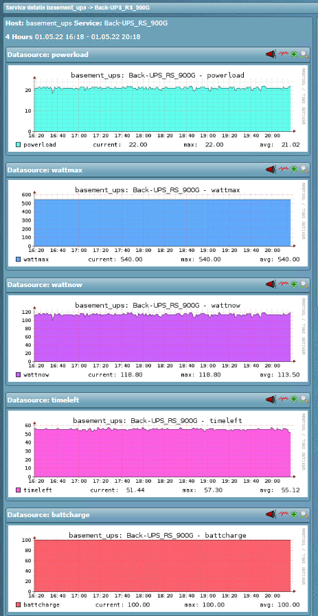

# APC UPS monitoring

| Name | Description |
|------|-------------|
| **Name** | check_apc |
| **Type** | piggyback plugin |
| **Description** | Extracts metrics from `apcupsd` and creates metrics from it |

## Installation

- `apcupsd` should be installed and configured with the respective UPS
- Create a new host in Check_MK with `Check_MK Agent` = `No agent`
- Put the check script on your piggyback host as `/usr/lib/check_mk_agent/plugins/check_apc`
- Modify the check script and set the correct piggiback host in the respective variable

Make sure [the piggyback mechanics are enabled](https://docs.checkmk.com/latest/en/piggyback.html) in your setup.

## Demo

