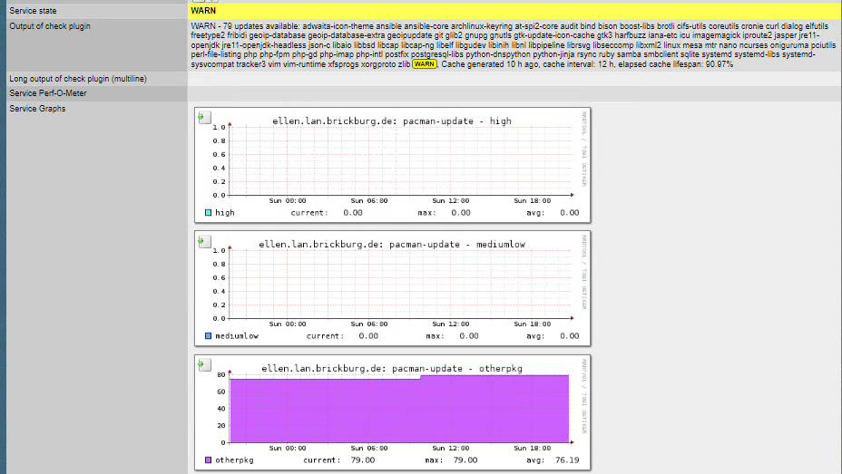

# Pacman Update Status

| Name | Description |
|------|-------------|
| **Name** | check_pacman |
| **Type** | local check |
| **Description** | Checks for pacman updates |

## Installation

- Put the check script on your host as `/usr/lib/check_mk_agent/local/43200/check_pacman`

## Demo

