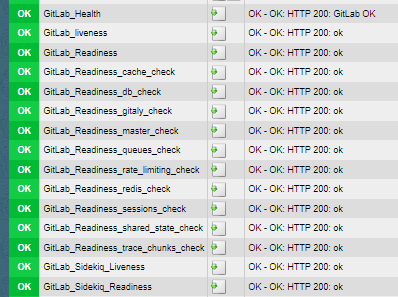

# GitLab Health Checks

| Name | Description |
|------|-------------|
| **Name** | check_gitlab |
| **Type** | local check |
| **Description** | Parses health/readiness/liveness endpoints from gitlab |

## Enable Health Check Endpoints

```rb
# /etc/gitlab/gitlab.rb
sidekiq['health_checks_enabled'] = true
sidekiq['health_checks_listen_address'] = "localhost"
sidekiq['health_checks_listen_port'] = "8092"

gitlab_rails['monitoring_whitelist'] = [ '127.0.0.0/8', '192.168.0.0/16' ]
```

Apply changes by executing `gitlab-ctl reconfigure`.

## Installation

- Put the check script on your GitLab host as `/usr/lib/check_mk_agent/local/check_gitlab`
- Put the config on your GitLab host as `/etc/check_mk/check_gitlab.conf`
- Modify the settings in the config file

## Demo


