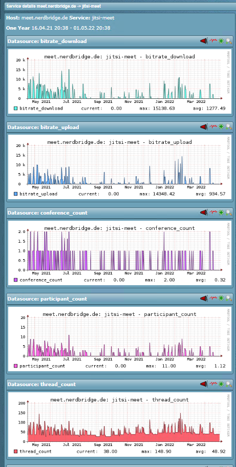

# GitLab Health Checks

| Name | Description |
|------|-------------|
| **Name** | check_jitsi |
| **Type** | local check |
| **Description** | Parses health endpoints from jitsi-meet |

## Enable Health Check Endpoints

```sh
# /etc/jitsi/videobridge/config
JVB_OPTS="--apis=rest,"
```

Apply changes by restarting the videobridge service.

## Installation

- Put the check script on your jitsi-meet host as `/usr/lib/check_mk_agent/local/check_jitsi`

## Demo


