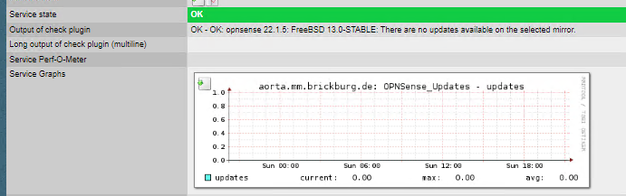

# OPNSense Updates

| Name | Description |
|------|-------------|
| **Name** | check_opnsense_updates |
| **Type** | piggyback plugin |
| **Description** | Parses check updates endpoint from OPNSense api |

## Installation

- SNMP Settings must be configured on OPNSense
- Router must be present in Check_MK as a SNMP monitored host
- Put the check script on your piggyback host as `/usr/lib/check_mk_agent/plugins/43200/check_opnsense_updates`
- Put the yml config on your puggyback host as `/etc/check_mk/check_opnsense_updates_config.yml`
- Modify the settings in the config file

Make sure [the piggyback mechanics are enabled](https://docs.checkmk.com/latest/en/piggyback.html) in your setup.

## Demo

